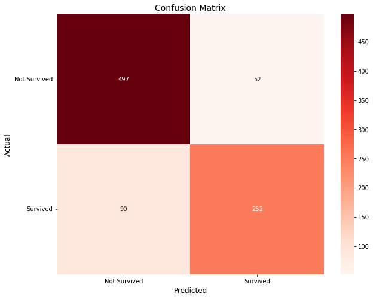

# Binary Predictions of Titanic Dataset

Data science project using supervised learning techniques to predict Survival of passengers aboard the Titanic.

# Overview
For this project, I performed supervised learning techniques to predict Survival of passengers aboard the Titanic. My goal was to explore different techniques to determine the best approach to a dataset that has no labels to better prepare myself to realworld problems were labels (solutions) are not always available. My goal was also to showcase the fundamental steps in the data life cycle, from exploratory data analysis, to feature engineering, to model development and lastly interpretation of the results.

During the exploratory data analysis phase, we determine strong correlations between features and labels, for example, gender and age, have a strong correlation with survival as females younger than 12.5 years had a higher rate of survival compared to older passengers of either gender. Due to the lack of features in the given dataset, we had to be resourceful and develop new features from the data set to allow our models to be more robust to overfitting and better with unseen data. After testing a variety of models including decision trees, Random Forest, Bayes Naive, Neural Networks, and XGBoost classifiers, we found that XGBoost and Random Forest perform best in a 10 fold cross validation set. We then perform a grid search of hyperparameters for our top two models to arrive to our final models. We chose the best two classifiers for this project to save on computation time, but a later project uses the third best model, the neural network, and perfoms an emsemble of simple aggregation to arrive to a more accurate solution. Our final Random Forest classifier achieved 0.78087 accuracy while our XGBoost achieved 0.75697 accuracy.

|  |
|:--:|
| <b>Fig 1 - Here we explore the importance of each of the final features chosen for training and predictions. </b>|

|  |
|:--:|
| <b>Fig 2.1 - We use a confussion matrix to determine the classification tendencies of the model during training.</b>|

# Notes
The source notebook contains comments throughout the code that explains the reasoning and/or some intuition about a function, feature or hyperparameter. To improve the accuracy of the scores, we can perform ensamble techniques to combine multiple weak learners or we perform a more thorough feature engineering.

# Data
I used the Kaggle's [Titanic](https://www.kaggle.com/competitions/titanic/data) dataset as it is known to be a great starting place for people that are new to data science.
